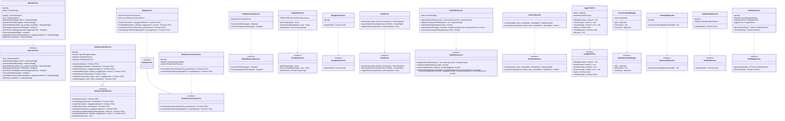

# Service Class Diagram

```mermaid
classDiagram
    direction TB

    class IQueryService {
        <<interface>>
        +dv() DataviewApi|null
        +getEntitiesByTag(tag, folder?) DataviewPage[]
        +getActiveEntitiesByTag(tag) DataviewPage[]
        +getLinkedEntities(folder, tag, property, targetFile) DataviewPage[]
        +getEngagementNameForPath(path) string|null
        +getClientFromEngagementLink(engagementLink) string|null
        +resolveClientName(page) string|null
        +getRaidItemsForContext(clientName?, engagementName?) DataviewPage[]
        +getReferences(filters?) DataviewPage[]
    }

    class QueryService {
        -app App
        -getApi() DataviewApi|null
        -folders FolderSettings
        +dv() DataviewApi|null
        +getEntitiesByTag(tag, folder?) DataviewPage[]
        +getActiveEntitiesByTag(tag) DataviewPage[]
        +getLinkedEntities(folder, tag, property, targetFile) DataviewPage[]
        +getEngagementNameForPath(path) string|null
        +getClientFromEngagementLink(engagementLink) string|null
        +resolveClientName(page) string|null
        +getRaidItemsForContext(clientName?, engagementName?) DataviewPage[]
        +getReferences(filters?) DataviewPage[]
    }

    class IEntityCreationService {
        <<interface>>
        +createClient(name) Promise~TFile~
        +createEngagement(name, clientName?) Promise~TFile~
        +createProject(name, engagementName?) Promise~TFile~
        +createPerson(name, clientName?) Promise~TFile~
        +createInboxNote(name, engagementName?) Promise~TFile~
        +createRecurringMeetingEvent(meetingName, options?) Promise~TFile~
        +createRaidItem(name, raidType, engagement?, owner?) Promise~TFile~
        +validateResult(result) void
    }

    class EntityCreationService {
        -app App
        -settings ProjectManagerSettings
        -templates ITemplateService
        -navigation INavigationService
        +createClient(name) Promise~TFile~
        +createEngagement(name, clientName?) Promise~TFile~
        +createProject(name, engagementName?) Promise~TFile~
        +createRaidItem(name, raidType, engagement?, owner?) Promise~TFile~
        +createReferenceTopic(name) Promise~TFile~
        +createReference(name, topics, client?, engagement?) Promise~TFile~
        +createEntity(type, name, folder, extraVars?) Promise~TFile~
    }

    class IEntityConversionService {
        <<interface>>
        +convertInboxToProject(inboxFile, projectName?) Promise~TFile~
        +convertSingleToRecurring(singleFile, recurringName?) Promise~TFile~
    }

    class EntityConversionService {
        -app App
        -settings ProjectManagerSettings
        -creation IEntityCreationService
        +convertInboxToProject(inboxFile, projectName?) Promise~TFile~
        +convertSingleToRecurring(singleFile, recurringName?) Promise~TFile~
    }

    class IEntityService {
        <<interface>>
    }

    class EntityService {
        -creation IEntityCreationService
        -conversion IEntityConversionService
        +createProject(name, engagementName?) Promise~TFile~
        +createRaidItem(name, raidType, engagement?, owner?) Promise~TFile~
        +convertInboxToProject(inboxFile, projectName?) Promise~TFile~
        +convertSingleToRecurring(singleFile, recurringName?) Promise~TFile~
    }

    class IEntityHierarchyService {
        <<interface>>
        +resolveClientName(page) string|null
        +resolveEngagementName(page) string|null
    }

    class EntityHierarchyService {
        -queryService IQueryService
        +resolveClientName(page) string|null
        +resolveEngagementName(page) string|null
    }

    class ITemplateService {
        <<interface>>
        +getTemplate(type) string
        +processTemplate(template, vars) string
        +defaultVars() Record~string,string~
    }

    class TemplateService {
        -TEMPLATES Record~EntityType,string~
        +getTemplate(type) string
        +processTemplate(template, vars) string
        +defaultVars() Record~string,string~
    }

    class INavigationService {
        <<interface>>
        +openFile(file) Promise~void~
    }

    class NavigationService {
        -app App
        +openFile(file) Promise~void~
    }

    class ITaskParser {
        <<interface>>
        +parseTaskLine(line, filePath, lineNumber) ParsedTask|null
        +parseTasksFromContent(content, filePath) ParsedTask[]
        +toggleTaskLine(originalLine, nowCompleted) string
    }

    class TaskParser {
        +parseTaskLine(line, filePath, lineNumber) ParsedTask|null
        +parseTasksFromContent(content, filePath) ParsedTask[]
        +toggleTaskLine(originalLine, nowCompleted) string
    }

    class ITaskFilterService {
        <<interface>>
        +applyDashboardFilters(tasks, f, dv, hierarchyService) DataviewTask[]
        +matchesDueDateFilter(task, filter) boolean
        +matchesTagFilter(task, tagFilter, includeUntagged) boolean
        +matchesClientFilter(task, clientFilter, includeUnassigned, dv, hierarchyService) boolean
        +matchesEngagementFilter(task, engagementFilter, includeUnassigned, dv, hierarchyService) boolean
    }

    class TaskFilterService {
        -folders FolderSettings
        +applyDashboardFilters(tasks, f, dv, hierarchyService) DataviewTask[]
        +applyContextSpecificFilters(tasks, f, dv) DataviewTask[]
        +matchesDueDateFilter(task, filter) boolean
        +matchesClientFilter(task, clientFilter, includeUnassigned, dv, hierarchyService) boolean
        +matchesInboxStatusFilter(pageStatus, filter) boolean
    }

    class ITaskSortService {
        <<interface>>
        +sortTasks(tasks, keys, contextMap?, mtimeMap?) DataviewTask[]
        +compareGroups(aTasks, bTasks, keys, contextMap?, mtimeMap?) number
    }

    class TaskSortService {
        +sortTasks(tasks, keys, contextMap?, mtimeMap?) DataviewTask[]
        +compareGroups(aTasks, bTasks, keys, contextMap?, mtimeMap?) number
    }

    class ILoggerService {
        <<interface>>
        +debug(message, context?) void
        +info(message, context?) void
        +warn(message, context?) void
        +error(message, context?, err?) void
        +flush() Promise~void~
        +cleanOldLogs() Promise~void~
    }

    class LoggerService {
        -buffer LogEntry[]
        -flushInterval ReturnType
        +debug(message, context?) void
        +info(message, context?) void
        +error(message, context?, err?) void
        +flush() Promise~void~
        +cleanOldLogs() Promise~void~
        +destroy() void
    }

    class IActionContextManager {
        <<interface>>
        +get() object|null
        +set(context) void
        +consume() object|null
    }

    class ActionContextManager {
        -context object|null
        +get() object|null
        +set(context) void
        +consume() object|null
    }

    class ICommandExecutor {
        <<interface>>
        +executeCommandById(commandId) void
    }

    class CommandExecutor {
        -app App
        +executeCommandById(commandId) void
    }

    class IScaffoldService {
        <<interface>>
        +scaffoldVault() Promise~void~
    }

    class VaultScaffoldService {
        -app App
        -settings ProjectManagerSettings
        +scaffoldVault() Promise~void~
    }

    class ITestDataService {
        <<interface>>
        +generateTestData() Promise~TestDataResult~
        +cleanTestData() Promise~number~
    }

    class TestDataService {
        -app App
        -settings ProjectManagerSettings
        -templateService ITemplateService
        -loggerService ILoggerService
        +generateTestData() Promise~TestDataResult~
        +cleanTestData() Promise~number~
    }

    IEntityService --|> IEntityCreationService
    IEntityService --|> IEntityConversionService

    QueryService ..|> IQueryService
    EntityCreationService ..|> IEntityCreationService
    EntityConversionService ..|> IEntityConversionService
    EntityService ..|> IEntityService
    EntityHierarchyService ..|> IEntityHierarchyService
    TemplateService ..|> ITemplateService
    NavigationService ..|> INavigationService
    TaskParser ..|> ITaskParser
    TaskFilterService ..|> ITaskFilterService
    TaskSortService ..|> ITaskSortService
    LoggerService ..|> ILoggerService
    ActionContextManager ..|> IActionContextManager
    CommandExecutor ..|> ICommandExecutor
    VaultScaffoldService ..|> IScaffoldService
    TestDataService ..|> ITestDataService
```
