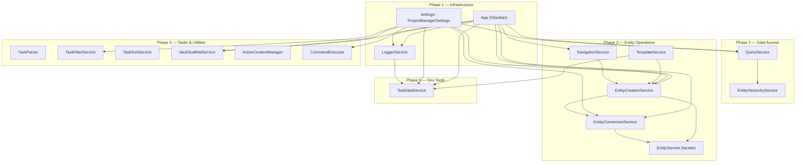

# Service Dependency Graph

Arrow `A --> B` means "A is passed as a constructor argument to B".

```mermaid
flowchart TD
    subgraph Phase1["Phase 1 — Infrastructure"]
        App["App (Obsidian)"]
        Settings["settings: ProjectManagerSettings"]
        LoggerService["LoggerService"]
    end

    subgraph Phase2["Phase 2 — Data Access"]
        QueryService["QueryService"]
        EntityHierarchyService["EntityHierarchyService"]
    end

    subgraph Phase3["Phase 3 — Entity Operations"]
        TemplateService["TemplateService"]
        NavigationService["NavigationService"]
        EntityCreationService["EntityCreationService"]
        EntityConversionService["EntityConversionService"]
        EntityService["EntityService (facade)"]
    end

    subgraph Phase4["Phase 4 — Tasks & Utilities"]
        TaskParser["TaskParser"]
        TaskFilterService["TaskFilterService"]
        TaskSortService["TaskSortService"]
        VaultScaffoldService["VaultScaffoldService"]
        ActionContextManager["ActionContextManager"]
        CommandExecutor["CommandExecutor"]
    end

    subgraph Phase5["Phase 5 — Dev Tools"]
        TestDataService["TestDataService"]
    end

    App --> LoggerService
    Settings --> LoggerService

    App --> QueryService
    Settings --> QueryService
    QueryService --> EntityHierarchyService

    App --> NavigationService
    App --> EntityCreationService
    Settings --> EntityCreationService
    TemplateService --> EntityCreationService
    NavigationService --> EntityCreationService

    App --> EntityConversionService
    Settings --> EntityConversionService
    EntityCreationService --> EntityConversionService

    EntityCreationService --> EntityService
    EntityConversionService --> EntityService

    Settings --> TaskFilterService
    App --> VaultScaffoldService
    Settings --> VaultScaffoldService
    App --> CommandExecutor

    App --> TestDataService
    Settings --> TestDataService
    TemplateService --> TestDataService
    LoggerService --> TestDataService
```
