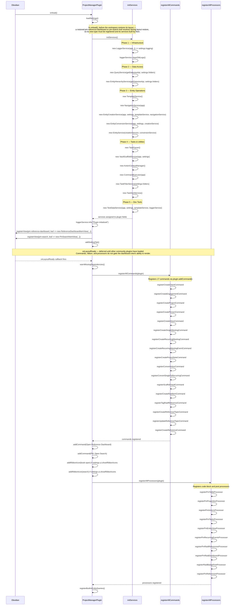

# Plugin Initialization Sequence

```mermaid
sequenceDiagram
    participant Obsidian
    participant ProjectManagerPlugin
    participant initServices
    participant registerAllCommands
    participant registerAllProcessors

    Obsidian->>ProjectManagerPlugin: onload()
    ProjectManagerPlugin->>ProjectManagerPlugin: loadSettings()

    Note over ProjectManagerPlugin,initServices: In onload(), before the workspace restores its layout —<br/>a restored pm-reference-dashboard or pm-search leaf resolves during layout restore,<br/>so its view type must be registered and its services built by then.

    ProjectManagerPlugin->>initServices: initServices()

    Note over initServices: Phase 1 — Infrastructure
    initServices->>initServices: new LoggerService(app, () => settings.logging)
    initServices->>initServices: loggerService.cleanOldLogs()

    Note over initServices: Phase 2 — Data Access
    initServices->>initServices: new QueryService(getDataviewApi, settings.folders)
    initServices->>initServices: new EntityHierarchyService(getDataviewApi, settings.folders)

    Note over initServices: Phase 3 — Entity Operations
    initServices->>initServices: new TemplateService()
    initServices->>initServices: new NavigationService(app)
    initServices->>initServices: new EntityCreationService(app, settings, templateService, navigationService)
    initServices->>initServices: new EntityConversionService(app, settings, creationService)
    initServices->>initServices: new EntityService(creationService, conversionService)

    Note over initServices: Phase 4 — Tasks & Utilities
    initServices->>initServices: new TaskParser()
    initServices->>initServices: new VaultScaffoldService(app, settings)
    initServices->>initServices: new ActionContextManager()
    initServices->>initServices: new CommandExecutor(app)
    initServices->>initServices: new TaskFilterService(settings.folders)
    initServices->>initServices: new TaskSortService()

    Note over initServices: Phase 5 — Dev Tools
    initServices->>initServices: new TestDataService(app, settings, templateService, loggerService)

    initServices-->>ProjectManagerPlugin: services assigned to plugin fields

    ProjectManagerPlugin->>ProjectManagerPlugin: loggerService.info("Plugin initialized")
    ProjectManagerPlugin->>Obsidian: registerView(pm-reference-dashboard, leaf => new ReferenceDashboardItemView(...))
    ProjectManagerPlugin->>Obsidian: registerView(pm-search, leaf => new PmSearchItemView(...))
    ProjectManagerPlugin->>ProjectManagerPlugin: addSettingTab()

    Note over Obsidian,registerAllProcessors: onLayoutReady — deferred until other community plugins have loaded.<br/>Commands, ribbon, and processors do not gate the dashboard view's ability to render.
    Obsidian-->>ProjectManagerPlugin: onLayoutReady callback fires
    ProjectManagerPlugin->>ProjectManagerPlugin: warnMissingDependencies()

    ProjectManagerPlugin->>registerAllCommands: registerAllCommands(plugin)
    Note over registerAllCommands: Registers 17 commands via plugin.addCommand()
    registerAllCommands->>registerAllCommands: registerCreateClientCommand
    registerAllCommands->>registerAllCommands: registerCreateEngagementCommand
    registerAllCommands->>registerAllCommands: registerCreateProjectCommand
    registerAllCommands->>registerAllCommands: registerCreatePersonCommand
    registerAllCommands->>registerAllCommands: registerCreateInboxCommand
    registerAllCommands->>registerAllCommands: registerCreateSingleMeetingCommand
    registerAllCommands->>registerAllCommands: registerCreateRecurringMeetingCommand
    registerAllCommands->>registerAllCommands: registerCreateRecurringMeetingEventCommand
    registerAllCommands->>registerAllCommands: registerCreateProjectNoteCommand
    registerAllCommands->>registerAllCommands: registerConvertInboxCommand
    registerAllCommands->>registerAllCommands: registerConvertSingleToRecurringCommand
    registerAllCommands->>registerAllCommands: registerScaffoldVaultCommand
    registerAllCommands->>registerAllCommands: registerCreateRaidItemCommand
    registerAllCommands->>registerAllCommands: registerTagRaidReferenceCommand
    registerAllCommands->>registerAllCommands: registerCreateReferenceTopicCommand
    registerAllCommands->>registerAllCommands: registerUpdateReferenceTopicCommand
    registerAllCommands->>registerAllCommands: registerCreateReferenceCommand
    registerAllCommands-->>ProjectManagerPlugin: commands registered

    ProjectManagerPlugin->>ProjectManagerPlugin: addCommand(Open Reference Dashboard)
    ProjectManagerPlugin->>ProjectManagerPlugin: addCommand(PM: Open Search)
    ProjectManagerPlugin->>ProjectManagerPlugin: addRibbonIcon(book-open) if settings.ui.showRibbonIcons
    ProjectManagerPlugin->>ProjectManagerPlugin: addRibbonIcon(search) if settings.ui.showRibbonIcons

    ProjectManagerPlugin->>registerAllProcessors: registerAllProcessors(plugin)
    Note over registerAllProcessors: Registers code block and post processors
    registerAllProcessors->>registerAllProcessors: registerPmTableProcessor
    registerAllProcessors->>registerAllProcessors: registerPmPropertiesProcessor
    registerAllProcessors->>registerAllProcessors: registerPmActionsProcessor
    registerAllProcessors->>registerAllProcessors: registerPmTasksProcessor
    registerAllProcessors->>registerAllProcessors: registerPmEntityViewProcessor
    registerAllProcessors->>registerAllProcessors: registerPmRecurringEventsProcessor
    registerAllProcessors->>registerAllProcessors: registerPmRaidReferencesProcessor
    registerAllProcessors->>registerAllProcessors: registerPmRaidDashboardProcessor
    registerAllProcessors->>registerAllProcessors: registerRaidBadgePostProcessor
    registerAllProcessors->>registerAllProcessors: registerPmReferencesProcessor
    registerAllProcessors-->>ProjectManagerPlugin: processors registered

    ProjectManagerPlugin->>ProjectManagerPlugin: registerBuiltInEntityQueries()
```
