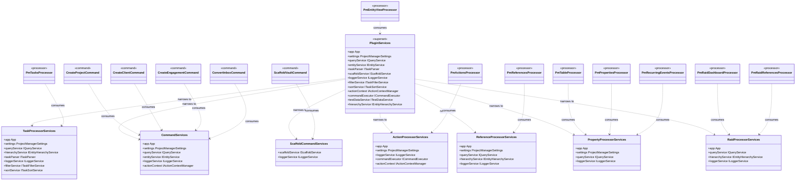

# Narrow Interface Bundles

ISP narrow-interface pattern: each consumer depends only on the services it needs.

```mermaid
classDiagram
    direction TB

    class PluginServices {
        <<superset>>
        +app App
        +settings ProjectManagerSettings
        +queryService IQueryService
        +entityService IEntityService
        +taskParser ITaskParser
        +scaffoldService IScaffoldService
        +loggerService ILoggerService
        +filterService ITaskFilterService
        +sortService ITaskSortService
        +actionContext IActionContextManager
        +commandExecutor ICommandExecutor
        +testDataService ITestDataService
        +hierarchyService IEntityHierarchyService
    }

    class CommandServices {
        +app App
        +settings ProjectManagerSettings
        +queryService IQueryService
        +entityService IEntityService
        +loggerService ILoggerService
        +actionContext IActionContextManager
    }

    class TaskProcessorServices {
        +app App
        +settings ProjectManagerSettings
        +queryService IQueryService
        +hierarchyService IEntityHierarchyService
        +taskParser ITaskParser
        +loggerService ILoggerService
        +filterService ITaskFilterService
        +sortService ITaskSortService
    }

    class PropertyProcessorServices {
        +app App
        +settings ProjectManagerSettings
        +queryService IQueryService
        +loggerService ILoggerService
    }

    class ActionProcessorServices {
        +app App
        +settings ProjectManagerSettings
        +loggerService ILoggerService
        +commandExecutor ICommandExecutor
        +actionContext IActionContextManager
    }

    class ScaffoldCommandServices {
        +scaffoldService IScaffoldService
        +loggerService ILoggerService
    }

    class RaidProcessorServices {
        +app App
        +queryService IQueryService
        +hierarchyService IEntityHierarchyService
        +loggerService ILoggerService
    }

    class ReferenceProcessorServices {
        +app App
        +settings ProjectManagerSettings
        +queryService IQueryService
        +hierarchyService IEntityHierarchyService
        +loggerService ILoggerService
    }

    class CreateProjectCommand {
        <<command>>
    }
    class CreateClientCommand {
        <<command>>
    }
    class CreateEngagementCommand {
        <<command>>
    }
    class ConvertInboxCommand {
        <<command>>
    }

    class PmTasksProcessor {
        <<processor>>
    }

    class PmTableProcessor {
        <<processor>>
    }
    class PmPropertiesProcessor {
        <<processor>>
    }
    class PmRecurringEventsProcessor {
        <<processor>>
    }
    class PmEntityViewProcessor {
        <<processor>>
    }

    class PmActionsProcessor {
        <<processor>>
    }

    class ScaffoldVaultCommand {
        <<command>>
    }

    class PmRaidDashboardProcessor {
        <<processor>>
    }
    class PmRaidReferencesProcessor {
        <<processor>>
    }

    class PmReferencesProcessor {
        <<processor>>
    }

    PluginServices ..> CommandServices : narrows to
    PluginServices ..> TaskProcessorServices : narrows to
    PluginServices ..> PropertyProcessorServices : narrows to
    PluginServices ..> ActionProcessorServices : narrows to
    PluginServices ..> ScaffoldCommandServices : narrows to
    PluginServices ..> RaidProcessorServices : narrows to
    PluginServices ..> ReferenceProcessorServices : narrows to

    CreateProjectCommand ..> CommandServices : consumes
    CreateClientCommand ..> CommandServices : consumes
    CreateEngagementCommand ..> CommandServices : consumes
    ConvertInboxCommand ..> CommandServices : consumes

    PmTasksProcessor ..> TaskProcessorServices : consumes

    PmTableProcessor ..> PropertyProcessorServices : consumes
    PmPropertiesProcessor ..> PropertyProcessorServices : consumes
    PmRecurringEventsProcessor ..> PropertyProcessorServices : consumes

    PmActionsProcessor ..> ActionProcessorServices : consumes

    ScaffoldVaultCommand ..> ScaffoldCommandServices : consumes

    PmRaidDashboardProcessor ..> RaidProcessorServices : consumes
    PmRaidReferencesProcessor ..> RaidProcessorServices : consumes

    PmReferencesProcessor ..> ReferenceProcessorServices : consumes

    PmEntityViewProcessor ..> PluginServices : consumes
```
