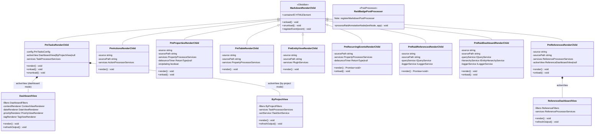

# Processor Class Hierarchy

```mermaid
classDiagram
    direction TB

    class MarkdownRenderChild {
        <<Obsidian>>
        +containerEl HTMLElement
        +onload() void
        +onunload() void
        +registerEvent(event) void
    }

    class PmTasksRenderChild {
        -config PmTasksConfig
        -activeView DashboardView|ByProjectView|null
        -services TaskProcessorServices
        +render() void
        +onload() void
        +onunload() void
    }

    class PmActionsRenderChild {
        -source string
        -sourcePath string
        -services ActionProcessorServices
        +render() void
    }

    class PmPropertiesRenderChild {
        -source string
        -sourcePath string
        -services PropertyProcessorServices
        -debounceTimer ReturnType|null
        -isUpdating boolean
        +render() void
        +onload() void
    }

    class PmTableRenderChild {
        -source string
        -sourcePath string
        -services PropertyProcessorServices
        +render() void
    }

    class PmEntityViewRenderChild {
        -source string
        -sourcePath string
        -services PluginServices
        +render() void
    }

    class PmRecurringEventsRenderChild {
        -sourcePath string
        -services PropertyProcessorServices
        -debounceTimer ReturnType|null
        +render() Promise~void~
        +onload() void
    }

    class PmRaidReferencesRenderChild {
        -source string
        -sourcePath string
        -queryService IQueryService
        -loggerService ILoggerService
        +render() Promise~void~
    }

    class PmRaidDashboardRenderChild {
        -source string
        -sourcePath string
        -queryService IQueryService
        -hierarchyService IEntityHierarchyService
        -loggerService ILoggerService
        +render() void
        +onload() void
    }

    class PmReferencesRenderChild {
        -source string
        -sourcePath string
        -services ReferenceProcessorServices
        -activeView ReferenceDashboardView|null
        +render() void
        +onload() void
    }

    class RaidBadgePostProcessor {
        <<PostProcessor>>
        Note: registerMarkdownPostProcessor
        +processRaidAnnotationNode(textNode, app) void
    }

    class DashboardView {
        -filters DashboardFilters
        -contextRenderer ContextViewRenderer
        -dateRenderer DateViewRenderer
        -priorityRenderer PriorityViewRenderer
        -tagRenderer TagViewRenderer
        +render() void
        +refreshOutput() void
    }

    class ByProjectView {
        -filters ByProjectFilters
        -services TaskProcessorServices
        -sortService ITaskSortService
        +render() void
        +refreshOutput() void
    }

    class ReferenceDashboardView {
        -filters ReferenceFilters
        -services ReferenceProcessorServices
        +render() void
        +refreshOutput() void
    }

    MarkdownRenderChild <|-- PmTasksRenderChild
    MarkdownRenderChild <|-- PmActionsRenderChild
    MarkdownRenderChild <|-- PmPropertiesRenderChild
    MarkdownRenderChild <|-- PmTableRenderChild
    MarkdownRenderChild <|-- PmEntityViewRenderChild
    MarkdownRenderChild <|-- PmRecurringEventsRenderChild
    MarkdownRenderChild <|-- PmRaidReferencesRenderChild
    MarkdownRenderChild <|-- PmRaidDashboardRenderChild
    MarkdownRenderChild <|-- PmReferencesRenderChild

    PmTasksRenderChild *-- DashboardView : activeView (dashboard mode)
    PmTasksRenderChild *-- ByProjectView : activeView (by-project mode)
    PmReferencesRenderChild *-- ReferenceDashboardView : activeView
```
