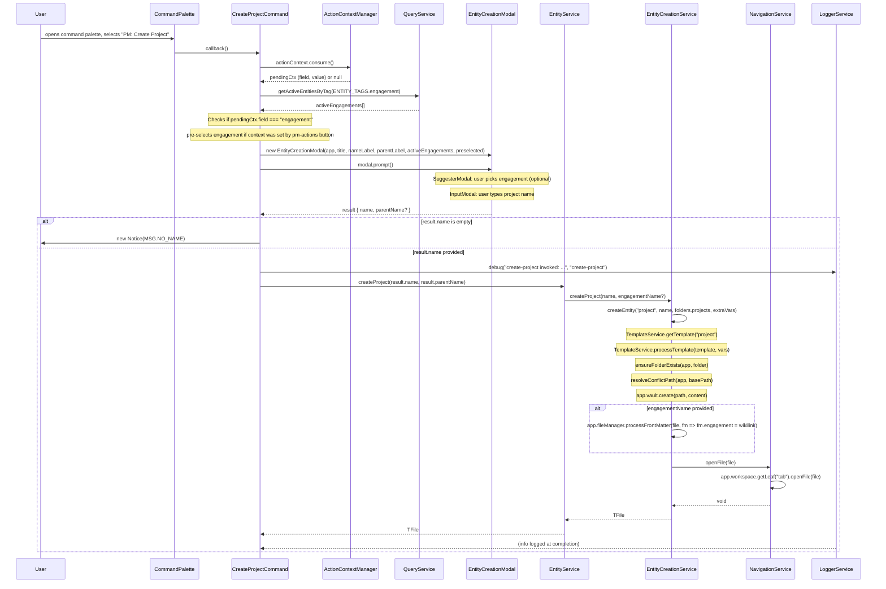

# Command Execution Sequence

End-to-end flow for `CreateProjectCommand` (`PM: Create Project`).

```mermaid
sequenceDiagram
    participant User
    participant CommandPalette
    participant CreateProjectCommand
    participant ActionContextManager
    participant QueryService
    participant EntityCreationModal
    participant EntityService
    participant EntityCreationService
    participant NavigationService
    participant LoggerService

    User->>CommandPalette: opens command palette, selects "PM: Create Project"
    CommandPalette->>CreateProjectCommand: callback()

    CreateProjectCommand->>ActionContextManager: actionContext.consume()
    ActionContextManager-->>CreateProjectCommand: pendingCtx (field, value) or null

    CreateProjectCommand->>QueryService: getActiveEntitiesByTag(ENTITY_TAGS.engagement)
    QueryService-->>CreateProjectCommand: activeEngagements[]

    Note over CreateProjectCommand: Checks if pendingCtx.field === "engagement"
    Note over CreateProjectCommand: pre-selects engagement if context was set by pm-actions button

    CreateProjectCommand->>EntityCreationModal: new EntityCreationModal(app, title, nameLabel, parentLabel, activeEngagements, preselected)
    CreateProjectCommand->>EntityCreationModal: modal.prompt()

    Note over EntityCreationModal: SuggesterModal: user picks engagement (optional)
    Note over EntityCreationModal: InputModal: user types project name

    EntityCreationModal-->>CreateProjectCommand: result { name, parentName? }

    alt result.name is empty
        CreateProjectCommand->>User: new Notice(MSG.NO_NAME)
    else result.name provided
        CreateProjectCommand->>LoggerService: debug("create-project invoked: ...", "create-project")

        CreateProjectCommand->>EntityService: createProject(result.name, result.parentName)
        EntityService->>EntityCreationService: createProject(name, engagementName?)

        EntityCreationService->>EntityCreationService: createEntity("project", name, folders.projects, extraVars)
        Note over EntityCreationService: TemplateService.getTemplate("project")
        Note over EntityCreationService: TemplateService.processTemplate(template, vars)
        Note over EntityCreationService: ensureFolderExists(app, folder)
        Note over EntityCreationService: resolveConflictPath(app, basePath)
        Note over EntityCreationService: app.vault.create(path, content)

        alt engagementName provided
            EntityCreationService->>EntityCreationService: app.fileManager.processFrontMatter(file, fm => fm.engagement = wikilink)
        end

        EntityCreationService->>NavigationService: openFile(file)
        NavigationService->>NavigationService: app.workspace.getLeaf("tab").openFile(file)
        NavigationService-->>EntityCreationService: void

        EntityCreationService-->>EntityService: TFile
        EntityService-->>CreateProjectCommand: TFile

        LoggerService-->>CreateProjectCommand: (info logged at completion)
    end
```
