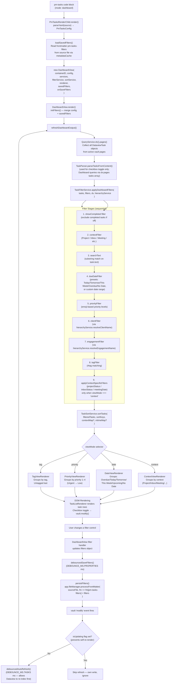

# Task Processing Pipeline

Data flow for the `pm-tasks` code block in **dashboard mode**.

```mermaid
flowchart TD
    A["pm-tasks code block\n(mode: dashboard)"] --> B

    B["PmTasksRenderChild.render()\nparseYaml(source) → PmTasksConfig"] --> C

    C["loadSavedFilters()\nRead frontmatter pm-tasks-filters\nfrom source file via metadataCache"] --> D

    D["new DashboardView(\n  containerEl, config, services,\n  filterService, sortService, renderer,\n  savedFilters, onSaveFilters\n)"] --> E

    E["DashboardView.render()\ninitFilters() — merge config + savedFilters"] --> F

    F["refreshDashboardOutput()"] --> G

    G["QueryService.dv().pages()\nCollect all DataviewTask objects\nfrom active vault pages"] --> H

    H["TaskParser.parseTasksFromContent()\n(used for checkbox toggle only;\nDashboard queries via dv.pages tasks array)"] --> I

    I["TaskFilterService.applyDashboardFilters(\n  tasks, filters, dv, hierarchyService\n)"] --> I1

    subgraph FilterStages["Filter Stages (sequential)"]
        I1["1. showCompleted filter\n(exclude completed tasks if off)"]
        I2["2. contextFilter\n(Project / Inbox / Meeting / etc.)"]
        I3["3. searchText\n(substring match on task.text)"]
        I4["4. dueDateFilter\n(presets: Today/Tomorrow/This Week/Overdue/No Date,\nor custom date range)"]
        I5["5. priorityFilter\n(emoji-based priority levels)"]
        I6["6. clientFilter\n(via hierarchyService.resolveClientName)"]
        I7["7. engagementFilter\n(via hierarchyService.resolveEngagementName)"]
        I8["8. tagFilter\n(#tag matching)"]
        I9["9. applyContextSpecificFilters\n(projectStatus / inboxStatus / meetingDate)\nonly when viewMode === 'context'"]

        I1 --> I2 --> I3 --> I4 --> I5 --> I6 --> I7 --> I8 --> I9
    end

    I --> FilterStages

    I9 --> J["TaskSortService.sortTasks(\n  filteredTasks, sortKeys,\n  contextMap?, mtimeMap?\n)"]

    J --> K{"viewMode selector"}

    K -->|"context"| L1["ContextViewRenderer\nGroups by context\n(Project/Inbox/Meeting/...)"]
    K -->|"date"| L2["DateViewRenderer\nGroups: Overdue/Today/Tomorrow/\nThis Week/Upcoming/No Date"]
    K -->|"priority"| L3["PriorityViewRenderer\nGroups by priority 1–4\n(Urgent → Low)"]
    K -->|"tag"| L4["TagViewRenderer\nGroups by tag,\nUntagged last"]

    L1 --> M["DOM Rendering\nTaskListRenderer renders task rows\nCheckbox toggle → vault.modify()"]
    L2 --> M
    L3 --> M
    L4 --> M

    M --> N["User changes a filter control"]
    N --> O["DashboardView filter handler\nupdates filters object"]
    O --> P["debouncedSaveFilters()\n(DEBOUNCE_MS.PROPERTIES ms)"]
    P --> Q["persistFilters()\napp.fileManager.processFrontMatter(\n  sourceFile, fm => fm[pm-tasks-filters] = filters\n)"]
    Q --> R["vault 'modify' event fires"]
    R --> S{"isUpdating flag set?\n(prevents self-re-render)"}
    S -->|"No"| T["debouncedAutoRefresh()\n(DEBOUNCE_MS.TASKS ms — allows\nDataview to re-index first)"]
    T --> F
    S -->|"Yes"| U["Skip refresh — own write, ignore"]
```
