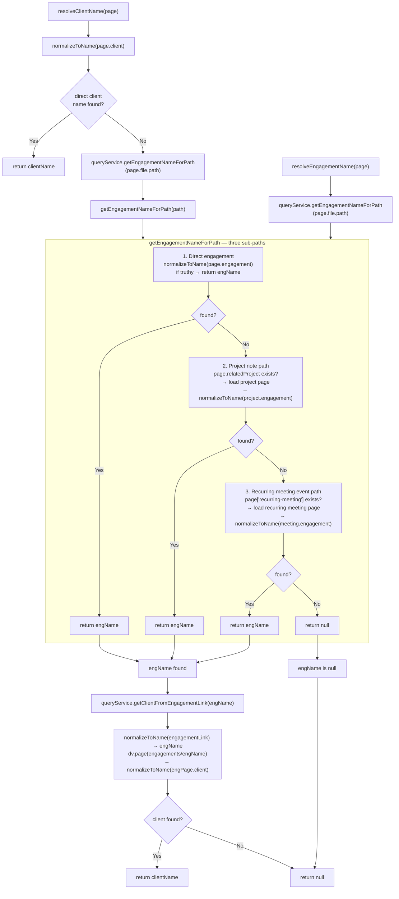

# Entity Hierarchy Resolution

Dual-path client and engagement resolution in `EntityHierarchyService`,
which delegates all traversal to `QueryService`.

```mermaid
flowchart TD
    A["resolveClientName(page)"] --> B

    B["normalizeToName(page.client)"] --> C{direct client\nname found?}

    C -->|"Yes"| D["return clientName"]

    C -->|"No"| E["queryService.getEngagementNameForPath\n(page.file.path)"]

    E --> F["getEngagementNameForPath(path)"]

    subgraph EngagementPaths["getEngagementNameForPath — three sub-paths"]
        F1["1. Direct engagement\nnormalizeToName(page.engagement)\nif truthy → return engName"]
        F2["2. Project note path\npage.relatedProject exists?\n→ load project page\n→ normalizeToName(project.engagement)"]
        F3["3. Recurring meeting event path\npage['recurring-meeting'] exists?\n→ load recurring meeting page\n→ normalizeToName(meeting.engagement)"]

        F1 --> FA{found?}
        FA -->|"Yes"| FB["return engName"]
        FA -->|"No"| F2

        F2 --> FC{found?}
        FC -->|"Yes"| FD["return engName"]
        FC -->|"No"| F3

        F3 --> FE{found?}
        FE -->|"Yes"| FF["return engName"]
        FE -->|"No"| FG["return null"]
    end

    F --> EngagementPaths

    FB --> G["engName found"]
    FD --> G
    FF --> G
    FG --> H["engName is null"]

    G --> I["queryService.getClientFromEngagementLink(engName)"]
    I --> J["normalizeToName(engagementLink) → engName\ndv.page(engagements/engName)\n→ normalizeToName(engPage.client)"]
    J --> K{client found?}
    K -->|"Yes"| L["return clientName"]
    K -->|"No"| M["return null"]

    H --> M

    N["resolveEngagementName(page)"] --> O["queryService.getEngagementNameForPath\n(page.file.path)"]
    O --> EngagementPaths
```
