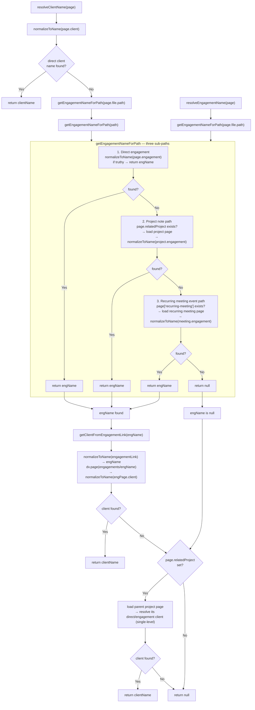
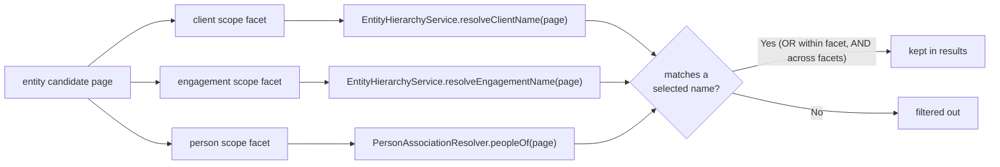

# Entity Hierarchy Resolution

Dual-path client and engagement resolution owned entirely by
`EntityHierarchyService` (it reads Dataview and the folder settings directly; it
no longer delegates to `QueryService`).

The parent-project fallback (path `P`) is what a project note whose parent
project carries a direct client — but no engagement — relies on: when the direct
and engagement chains yield nothing, `resolveClientName` resolves the parent
project's own direct/engagement client. This is single-level and bounded — it
does not follow another `relatedProject` hop on the parent — so a malformed
parent chain cannot recurse without end.

## Reuse by contextual search

The `pm-search` scope facets (`src/services/search-filter.ts`) do **not**
re-implement any of this traversal. The client and engagement scope predicates
call `resolveClientName` / `resolveEngagementName` on each candidate page and keep
it when the resolved name matches a selected scope name (OR within a facet), and
`SearchService` reuses the same two methods to build each result's Client ›
Engagement breadcrumb. The person scope facet is the one addition search brings:
`PersonAssociationResolver.peopleOf(page)` is a separate, focused resolver
(Person note self, RAID `owner`, meeting `attendees` / `default-attendees`, and
the `reports-to` chain), because person links are not part of the upward
client/engagement chain — there is no downward multi-hop traversal and no
team-members field.

