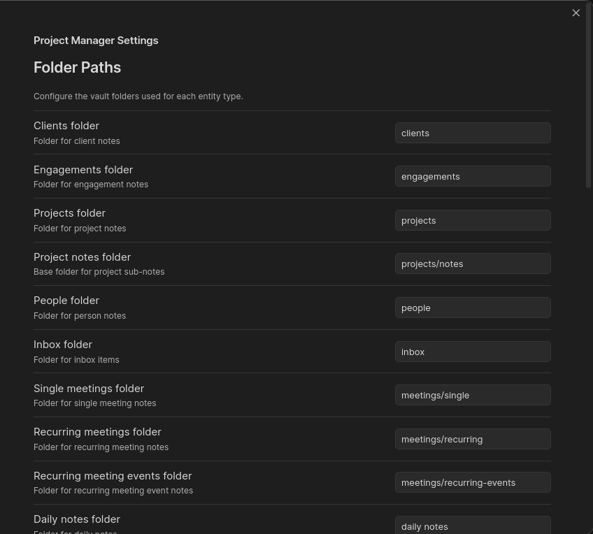
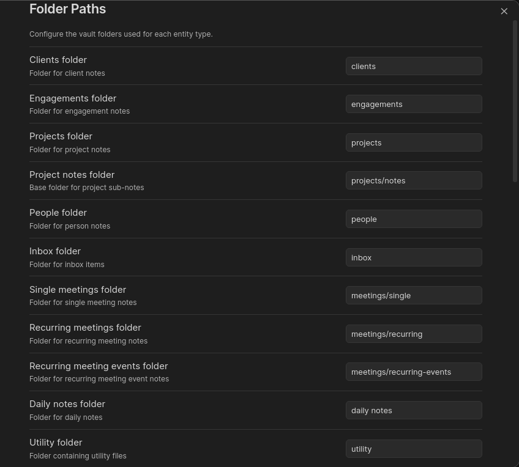
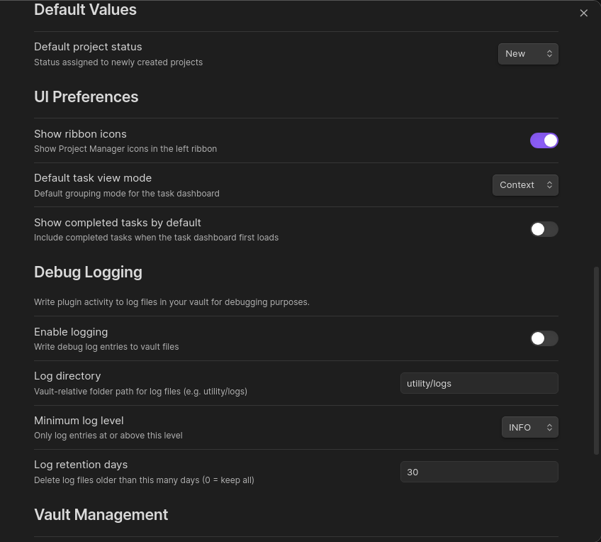
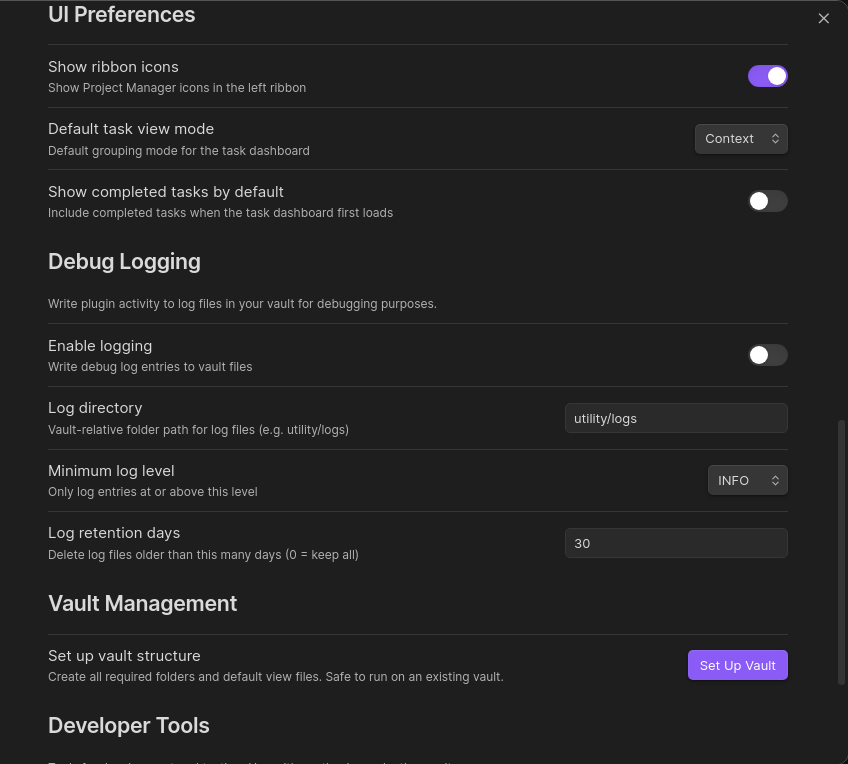
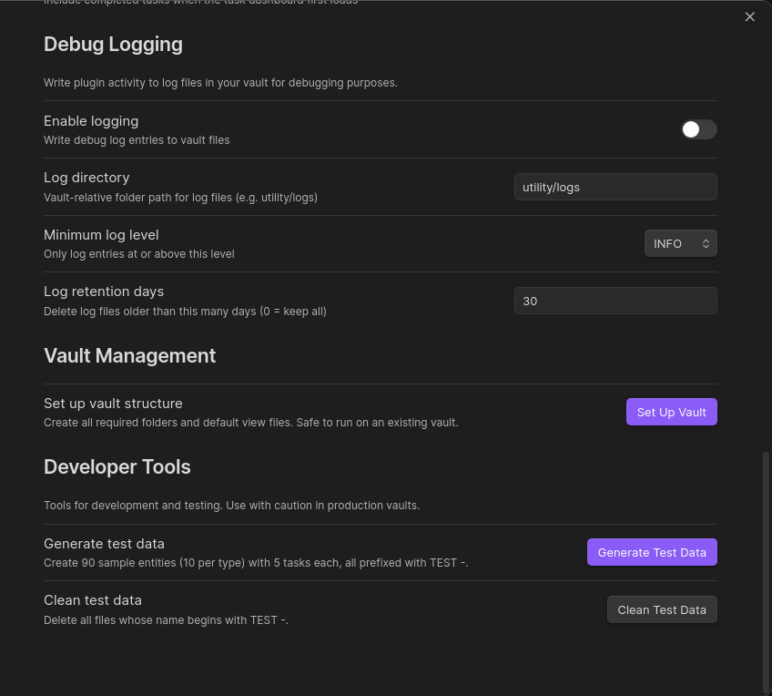

# Settings Reference

Open **Settings → Project Manager** to configure the plugin.

---

## Folder Paths

Configures the vault folder used for each entity type. All paths are relative to your vault root. Changing a folder path here does **not** move existing notes — it only changes where new notes are created and where the plugin looks for existing ones.

| Setting | Default | Description |
|---------|---------|-------------|
| Clients folder | `clients` | Folder for Client notes |
| Engagements folder | `engagements` | Folder for Engagement notes |
| Projects folder | `projects` | Folder for Project notes |
| Project notes folder | `projects/notes` | Base folder for Project sub-notes. Each project gets its own sub-folder here, named after the project in snake_case. |
| People folder | `people` | Folder for Person notes |
| Inbox folder | `inbox` | Folder for Inbox notes |
| Single meetings folder | `meetings/single` | Folder for Single Meeting notes |
| Recurring meetings folder | `meetings/recurring` | Folder for Recurring Meeting notes |
| Recurring meeting events folder | `meetings/recurring-events` | Folder for Recurring Meeting Event notes |
| Daily notes folder | `daily-notes` | Folder the plugin scans for daily notes (used by the task dashboard context filter) |
| Utility folder | `utility` | Folder for plugin-generated view files and logs |
| RAID folder | `raid` | Folder for RAID item notes |
| References folder | `references` | Folder for Reference documents |
| Reference Topics folder | `reference-topics` | Folder for Reference Topic notes |

**Tip:** If you already have an existing folder structure, update these settings before running PM: Set Up Vault Structure so the scaffolding creates folders in the right places.

---

## Default Values

| Setting | Default | Valid values | Description |
|---------|---------|--------------|-------------|
| Default project status | `New` | New, Active, On Hold | Status assigned to newly created projects |

---

## UI Preferences

| Setting | Default | Description |
|---------|---------|-------------|
| Show ribbon icons | On | Show Project Manager shortcut icons in the left ribbon bar. Disable if you prefer a cleaner sidebar. |
| Default task view mode | Context | Default grouping mode for the task dashboard when it first loads. Options: **Context** (by project/meeting/etc.), **Due Date**, **Priority**, **Tag**. |
| Show completed tasks by default | Off | When on, completed tasks are shown in the task dashboard on first load. |

---

## Debug Logging

When enabled, the plugin writes log entries to Markdown files in your vault. Useful for diagnosing unexpected behaviour — leave it off in normal use.

| Setting | Default | Description |
|---------|---------|-------------|
| Enable logging | Off | Write debug log entries to vault files |
| Log directory | `utility/logs` | Vault-relative folder path for log files |
| Minimum log level | INFO | Only log entries at or above this level. Options: DEBUG, INFO, WARN, ERROR. |
| Log retention days | 30 | Delete log files older than this many days. Set to 0 to keep all logs indefinitely. |

---

## Vault Management

| Button | Description |
|--------|-------------|
| **Set Up Vault** | Create all required folders and default view files. Safe to run on an existing vault — existing files are not overwritten. |

---

## Developer Tools

These buttons are intended for testing and development. Use with caution in a vault containing real data.

| Button | Description |
|--------|-------------|
| **Generate Test Data** | Creates 90 sample entities (10 per type) with 5 tasks each. All generated notes are prefixed with `TEST -` so they are easy to identify and clean up. |
| **Clean Test Data** | Deletes all notes whose filename begins with `TEST -`. |
