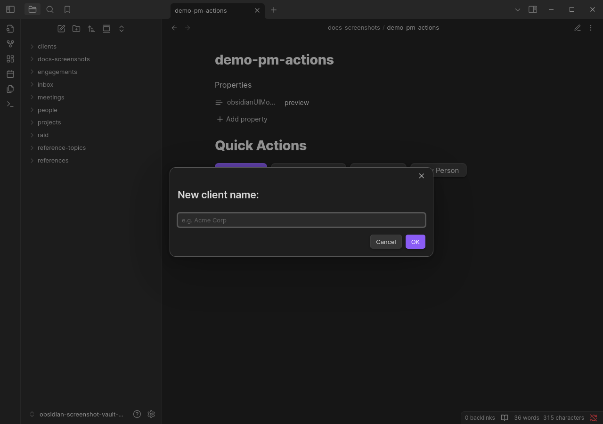
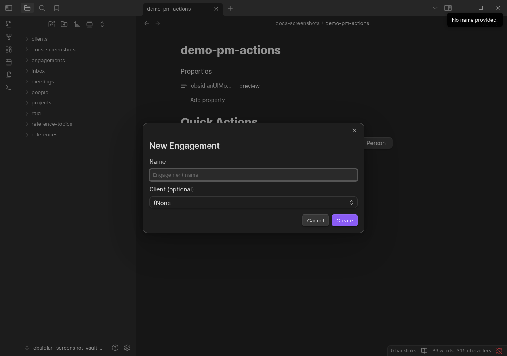
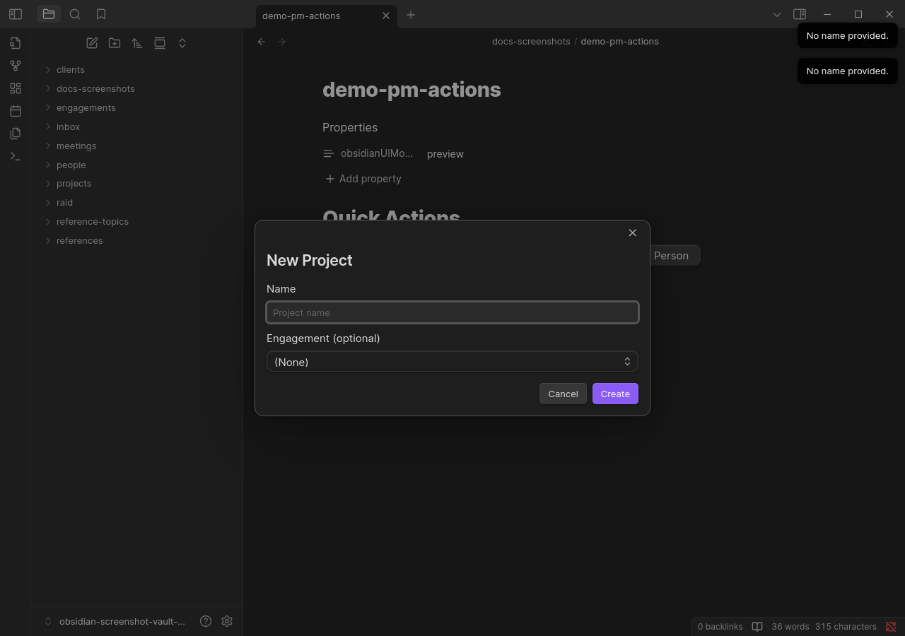
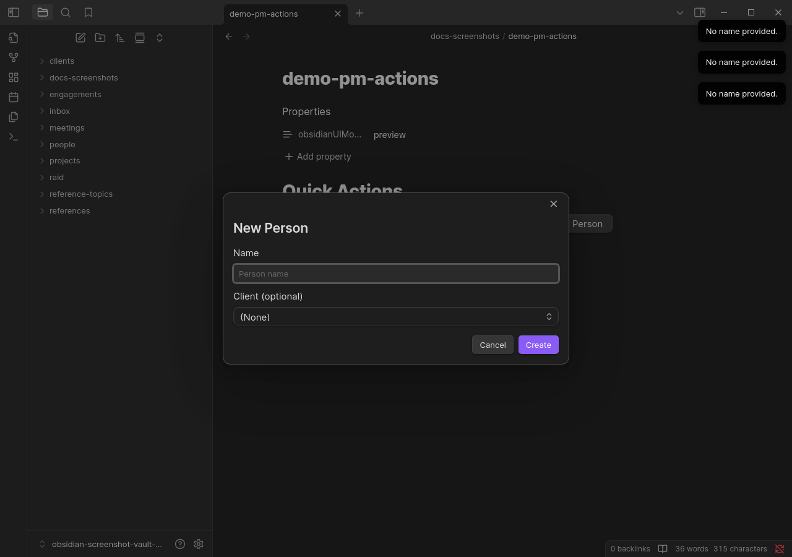
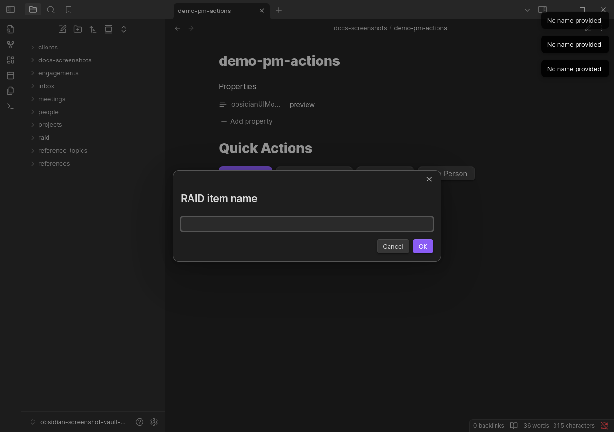
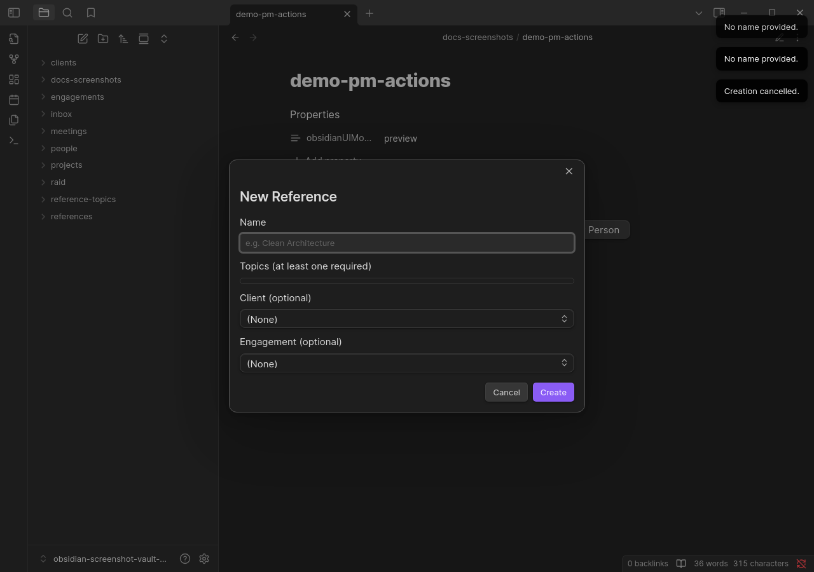

# Commands Reference

All commands are accessible via the command palette (`Ctrl/Cmd + P`) — search for **PM:** to filter to Project Manager commands. Many commands can also be triggered from action buttons embedded in entity notes (see [`pm-actions`](04-processors/pm-actions.md)).

## Invocation Methods

PM commands can be triggered in three ways:

| Method | How to access | Which commands |
|--------|---------------|----------------|
| **Command palette** | `Ctrl/Cmd + P`, then search **PM:** | All commands |
| **Slash command** | Type `/` in the editor, then search the command name | Editor commands only (see note below) |
| **Action button** | `pm-actions` code block in a note | Most creation and conversion commands (see note below) |

> **Editor commands vs. global commands**
>
> Obsidian distinguishes two types of commands:
> - **Editor commands** (`editorCallback`) — require an active editor and cursor position. They appear in both the command palette *and* the slash command menu (triggered by typing `/` in the editor).
> - **Global commands** (`callback`) — always available from the command palette regardless of what is open. They do **not** appear in the slash command menu.
>
> Only **`PM: Tag Line as RAID Reference`** is an editor command. It is specifically designed for in-editor use because it operates on the current cursor position or selection, appending the RAID badge annotation to the active line. All other PM commands are global commands and will not appear in the slash command menu.

> **`pm-actions` coverage**
>
> The `pm-actions` code block processor supports action buttons for all creation, conversion, and infrastructure commands. The one exception is `PM: Tag Line as RAID Reference` — it has no corresponding `pm-actions` action type because it requires an active editor context that action buttons cannot provide.

---

## Entity Creation Commands

### PM: Create Client

Creates a new Client note in the clients folder.

**Invocation:** Command palette · Action button (`create-client`)

**Pre-conditions:** None.

**Modal flow:**
1. Enter the client name → the note is created at `clients/<Name>.md`

---

### PM: Create Engagement

Creates a new Engagement note and links it to a Client.

**Invocation:** Command palette · Action button (`create-engagement`)

**Pre-conditions:** At least one Client note must exist in the clients folder.

**Modal flow:**
1. Enter the engagement name
2. Select a client from the autocomplete list → the engagement is linked to the selected client

---

### PM: Create Project

Creates a new Project note and links it to an Engagement.

**Invocation:** Command palette · Action button (`create-project`)

**Pre-conditions:** At least one Engagement note must exist.

**Modal flow:**
1. Enter the project name
2. Select an engagement from the autocomplete list → the project is linked

---

### PM: Create Person

Creates a new Person note and links it to a Client.

**Invocation:** Command palette · Action button (`create-person`)

**Pre-conditions:** At least one Client note must exist.

**Modal flow:**
1. Enter the person's name
2. Select a client from the autocomplete list

---

### PM: Create Inbox Note

Creates a lightweight capture note in the inbox folder. Inbox notes can later be promoted to Projects.

**Invocation:** Command palette · Action button (`create-inbox`)

**Pre-conditions:** None (engagement selection is optional).

**Modal flow:**
1. Enter the note name
2. Optionally select an engagement

---

### PM: Create Single Meeting

Creates a Single Meeting note linked to an Engagement.

**Invocation:** Command palette · Action button (`create-single-meeting`)

**Pre-conditions:** At least one Engagement note must exist.

**Modal flow:**
1. Enter the meeting name
2. Select an engagement
3. Enter the meeting date and time

---

### PM: Create Recurring Meeting

Creates a Recurring Meeting series note.

**Invocation:** Command palette · Action button (`create-recurring-meeting`)

**Pre-conditions:** At least one Engagement note must exist.

**Modal flow:**
1. Enter the meeting series name
2. Select an engagement

---

### PM: Create Recurring Meeting Event

Creates an event instance for a Recurring Meeting.

**Invocation:** Command palette · Action button (`create-recurring-meeting-event`)

**Pre-conditions:** At least one Recurring Meeting note must exist.

**Modal flow:**
1. Select the recurring meeting series
2. Enter the event date and time → the event note is created in a sub-folder named after the recurring meeting

---

### PM: Create Project Note

Creates a Project Note linked to a Project.

**Invocation:** Command palette · Action button (`create-project-note`)

**Pre-conditions:** At least one Project note must exist.

**Modal flow:**
1. Enter the note name
2. Select a project → the note is created inside the project's notes directory and linked back to the project

---

### PM: Create RAID Item

Creates a RAID item (Risk, Assumption, Issue, or Decision).

**Invocation:** Command palette · Action button (`create-raid-item`)

**Pre-conditions:** None (client/engagement/owner are optional).

**Modal flow:**
1. Enter the item name
2. Select the RAID type (Risk / Assumption / Issue / Decision)
3. Optionally select an engagement and owner

---

### PM: Create Reference Topic

Creates a Reference Topic note used to categorise references.

**Invocation:** Command palette · Action button (`create-reference-topic`)

**Pre-conditions:** None.

**Modal flow:**
1. Enter the topic name

---

### PM: Create Reference

Creates a Reference document and links it to one or more Reference Topics.

**Invocation:** Command palette · Action button (`create-reference`)

**Pre-conditions:** At least one Reference Topic note must exist.

**Modal flow:**
1. Enter the reference name
2. Select one or more topics

---

## Conversion Commands

### PM: Convert Inbox to Project

Promotes an Inbox Note to a full Project. The inbox note is marked as converted and the new project note inherits the engagement link.

**Invocation:** Command palette · Action button (`convert-inbox`)

**Pre-conditions:** The currently open note must be an Inbox Note (located in the inbox folder).

**How to invoke:** Open an Inbox Note, then run this command from the palette. No modal is shown — the conversion happens immediately.

**What changes:**
- A new Project note is created, linked to the inbox note's engagement
- The inbox note's `status` is set to `Inactive`
- The inbox note's `convertedTo` field is set to link to the new project

---

### PM: Convert Single Meeting to Recurring

Converts a Single Meeting note into a Recurring Meeting series.

**Invocation:** Command palette · Action button (`convert-single-to-recurring`)

**Pre-conditions:** The currently open note must be a Single Meeting (located in the single meetings folder).

**How to invoke:** Open a Single Meeting note, then run this command from the palette.

**What changes:**
- A new Recurring Meeting note is created, inheriting the engagement link
- The single meeting note is moved to the recurring meetings folder

---

## Infrastructure Commands

### PM: Set Up Vault Structure

Creates all required folders and default view files (Task Dashboard, Tasks By Project) in the utility folder. Safe to re-run on an existing vault — existing files are not overwritten.

**Invocation:** Command palette · Action button (`scaffold-vault`) · Settings tab button

**Pre-conditions:** None.

---

### PM: Tag Line as RAID Reference

Annotates the currently selected line in the editor with a directional RAID reference badge, linking it to a RAID item. The badge renders inline as a styled label (e.g. "↑ Mitigates", "↓ Escalates").

**Invocation:** Command palette · **Slash command** (type `/` in the editor — requires active editor)

> This is the only PM command registered as an **editor command** (`editorCallback`). It appears in the slash command menu because it operates on the current cursor position or line selection. It cannot be triggered via a `pm-actions` action button.

**Pre-conditions:** A line must be selected or the cursor must be on a line in the editor. At least one RAID item must exist.

**Modal flow:**
1. Select a RAID item
2. Select the direction: Positive, Negative, or Neutral

The annotation `{raid:positive}[[RAID Item Name]]` is appended to the line. It renders as a badge in reading view and is tracked as a backlink on the RAID item.
