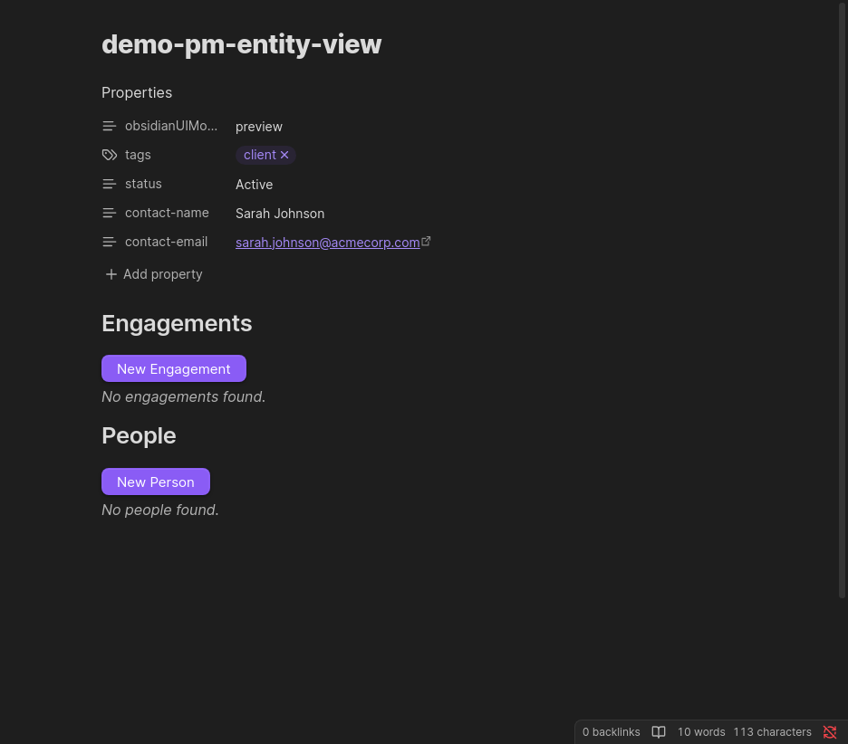

# pm-entity-view

Renders a combined section with a heading, an action button, and a relationship table — all in a single, concise code block. It is a shorthand for the common pattern of combining `pm-actions` and `pm-table`.



---

## Configuration

````markdown
```pm-entity-view
entity: <entity-type>
section: <section-name>
```
````

| Parameter | Required | Description |
|-----------|----------|-------------|
| `entity` | Yes | The entity type — see valid combinations below |
| `section` | Yes | Which pre-defined section to render |

### Valid entity + section combinations

| `entity` | `section` | Heading rendered | Button | Table |
|----------|-----------|------------------|--------|-------|
| `client` | `engagements` | Engagements | New Engagement | Client engagements |
| `client` | `people` | People | New Person | Client people |
| `engagement` | `projects` | Projects | New Project | Engagement projects |
| `project` | `linked` | Linked | New Project Note | Related project notes |
| `person` | `mentions` | Mentions | *(none)* | Mentions (backlinks) |

---

## Examples

### Client note

````markdown
```pm-entity-view
entity: client
section: engagements
```

```pm-entity-view
entity: client
section: people
```
````

### Engagement note

````markdown
```pm-entity-view
entity: engagement
section: projects
```
````

### Project note

````markdown
```pm-entity-view
entity: project
section: linked
```
````

---

## When to use pm-entity-view vs separate pm-actions + pm-table

Use `pm-entity-view` for standard entity sections — it is less config to write and matches the default note templates. Use separate `pm-actions` and `pm-table` blocks when you need custom button labels, multiple buttons, or a table type not covered by the registry (for example, a `mentions` table alongside a custom action set).
