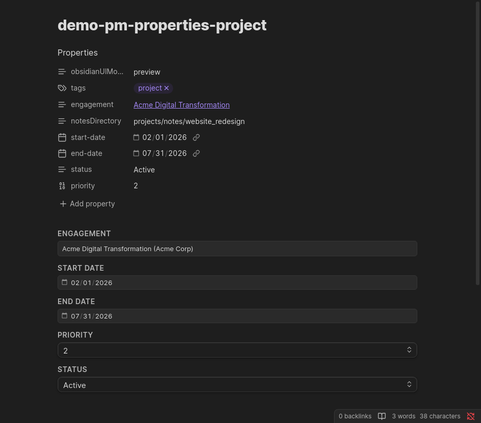
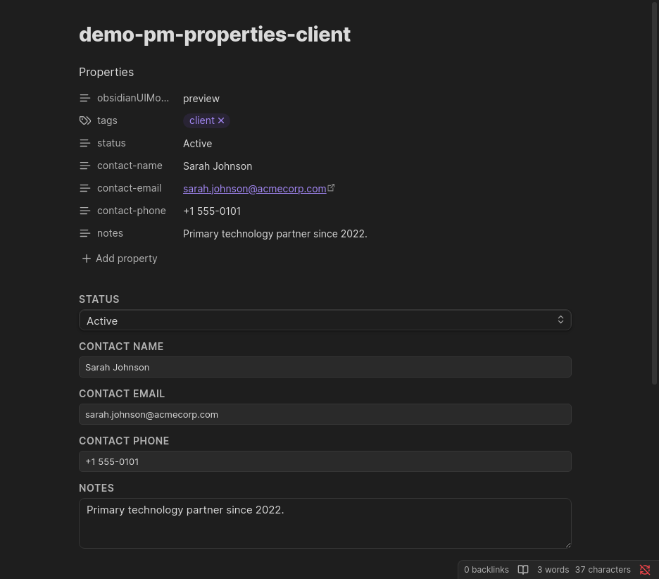

# pm-properties

Renders an interactive inline editor for the current note's frontmatter fields. Changes are saved immediately — no save button required.



---

## Configuration

````markdown
```pm-properties
entity: <entity-type>
```
````

| Parameter | Required | Values | Description |
|-----------|----------|--------|-------------|
| `entity` | Yes | See table below | The entity type whose fields to display |

### Entity types

| `entity` value | Fields shown |
|----------------|--------------|
| `client` | Status, Contact Name, Contact Email, Contact Phone, Notes |
| `engagement` | Client, Status, Start Date, End Date, Description |
| `project` | Engagement, Start Date, End Date, Priority, Status |
| `person` | Client, Status, Title, Reports To, Notes |
| `inbox` | Engagement, Status |
| `single-meeting` | Engagement, Date, Attendees |
| `recurring-meeting` | Engagement, Start Date, End Date, Default Attendees |
| `recurring-meeting-event` | Recurring Meeting, Date, Attendees |
| `project-note` | Related Project, Engagement |
| `raid` | Type, Client, Engagement, Status, Likelihood, Impact, Owner, Raised Date, Closed Date, Description |

---

## Example

````markdown
```pm-properties
entity: project
```
````

Place this at the top of a project note. The editor renders the project's Engagement, dates, Priority (1–4), and Status fields. All changes persist immediately to the note's frontmatter.

---

## Field Behaviour

### Autocomplete suggesters

Fields that reference other entities (Client, Engagement, Related Project, etc.) use an inline autocomplete combobox:

- **Type to filter** — options are filtered by case-insensitive substring match
- **Keyboard navigation** — `↑`/`↓` to move, `Enter` to select, `Escape` to cancel
- **Enriched display** — engagement and person options are shown as `"Name (Client)"` to distinguish entities with similar names
- **Click to open** — clicking the input opens the suggestion list even when it already has focus

### List suggesters (Attendees, Default Attendees)

For multi-value fields, selected items appear as removable chips above the input. Click `×` on a chip to remove it. The suggestion list reopens automatically after each selection so you can add multiple items in sequence.

### Status and closed-date automation

For RAID items, when the `status` field is changed to **Resolved** or **Closed**, the `closed-date` field is automatically set to today's date. Changing the status back to **Open** or **In Progress** clears the closed date.

---

## Placement

Place `pm-properties` at the **top** of the note, before any body content. It works in both editing view and reading view, but is most useful in reading view where frontmatter is otherwise hidden.


