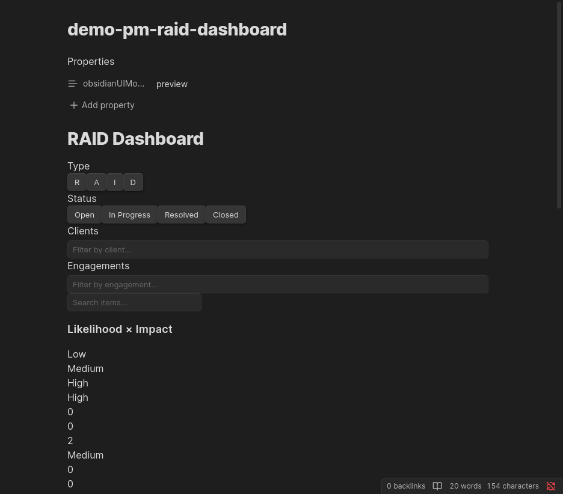

# pm-raid-dashboard

Renders an interactive RAID dashboard with a likelihood × impact risk matrix, a count strip, and item tables grouped by RAID type. Place this block in any note — an engagement overview note or a dedicated RAID tracking note are common choices.



---

## Configuration

````markdown
```pm-raid-dashboard
# All fields are optional
raidTypes:
  - Risk
  - Assumption
  - Issue
  - Decision
statusFilter:
  - Open
  - In Progress
clientFilter: []
engagementFilter: []
```
````

| Parameter | Type | Default | Description |
|-----------|------|---------|-------------|
| `raidTypes` | `string[]` | All four types | RAID types shown in the dashboard on initial load |
| `statusFilter` | `string[]` | `["Open", "In Progress"]` | Statuses shown on initial load |
| `clientFilter` | `string[]` | `[]` | Client names to pre-filter by on initial load |
| `engagementFilter` | `string[]` | `[]` | Engagement names to pre-filter by on initial load |

---

## Dashboard Sections

### Filter panel

At the top of the dashboard:

| Control | Description |
|---------|-------------|
| **Type chips** | Toggle individual RAID types (R / A / I / D) on or off |
| **Status chips** | Toggle statuses (Open, In Progress, Resolved, Closed) on or off |
| **Search input** | Live text filter on item names (debounced 300 ms) |

### Risk matrix

A **likelihood × impact** grid (High / Medium / Low on each axis) shows the count of filtered items in each cell. Cells are colour-coded by risk severity — high likelihood + high impact cells are shown in red, low-risk cells in green.

Click a cell to apply a matrix filter (only items in that likelihood/impact combination are shown). Click the cell again to clear the filter.

### Count strip

A row of total counts per RAID type, updated whenever filters change.

### Item tables

Below the matrix, items are grouped by RAID type and rendered as sortable tables with columns:

| Column | Description |
|--------|-------------|
| Title | Linked note name |
| Status | Current status |
| L × I | Likelihood × Impact abbreviations (e.g. H × H) |
| Age | Days since `raised-date` |
| Owner | Owner's initials shown as an avatar |

---

## Requirements

- The **Dataview plugin** must be installed and enabled
- RAID items must have the `#raid` tag (added automatically by **PM: Create RAID Item**)

---

## Behaviour

- Queries all RAID items tagged `#raid` in the vault via Dataview
- Filter state (type chips, status chips, matrix cell selection, search text) resets on page reload — it is not persisted to frontmatter. Use the YAML config to set persistent defaults.
- Auto-refreshes (500 ms debounce) when any vault file is modified

---

## Examples

### Engagement overview — show only open items for one engagement

````markdown
```pm-raid-dashboard
statusFilter:
  - Open
  - In Progress
engagementFilter:
  - "Acme Digital Transformation"
```
````

### Decisions-only tracker

````markdown
```pm-raid-dashboard
raidTypes:
  - Decision
statusFilter:
  - Open
  - In Progress
  - Resolved
  - Closed
```
````
