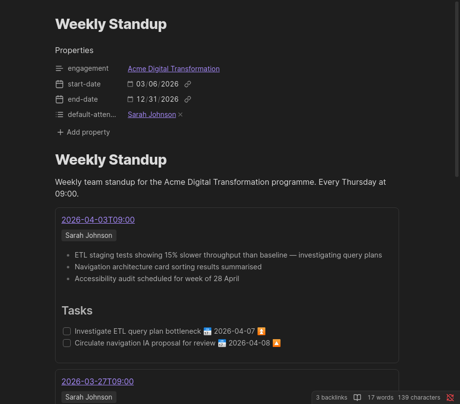

# pm-recurring-events

Renders a chronological tile grid of all event instances for a recurring meeting. Place this block in a Recurring Meeting note — the meeting name is inferred automatically from the note's filename.



---

## Configuration

````markdown
```pm-recurring-events
```
````

No configuration parameters are required. The block reads the current note's filename to identify which recurring meeting to display events for.

---

## What Each Tile Shows

Each tile represents one Recurring Meeting Event note and displays:

| Field | Source |
|-------|--------|
| **Date** | `date` frontmatter field, formatted as `YYYY-MM-DD HH:mm`; links to the event note |
| **Attendees** | Comma-separated list of names from the `attendees` frontmatter field (hidden when empty) |
| **Notes** | Rendered Markdown content from the `# Notes` section of the event file |

Notes in event tiles support full Markdown: `**bold**`, `*italic*`, `- lists`, `[[wikilinks]]`, and more.

---

## Behaviour

- Events are sorted **newest-first** by their `date` frontmatter field
- The block auto-refreshes (1 second debounce) whenever any vault file is modified
- Requires the **Dataview plugin** — renders a "Dataview not available" message if it is missing

---

## Setup

1. Create a Recurring Meeting note using **PM: Create Recurring Meeting**
2. Add the `pm-recurring-events` block to the note body
3. Create event instances using **PM: Create Recurring Meeting Event** — selecting the recurring meeting as the parent

Events appear in the tile grid as soon as Dataview indexes the new event files (usually within a second).

---

## Example

Recurring meeting note `meetings/recurring/Weekly Standup.md`:

````markdown
---
engagement: "[[Acme Digital Transformation]]"
start-date: 2026-03-06
default-attendees:
  - "[[Sarah Johnson]]"
---

# Weekly Standup

```pm-recurring-events
```
````
