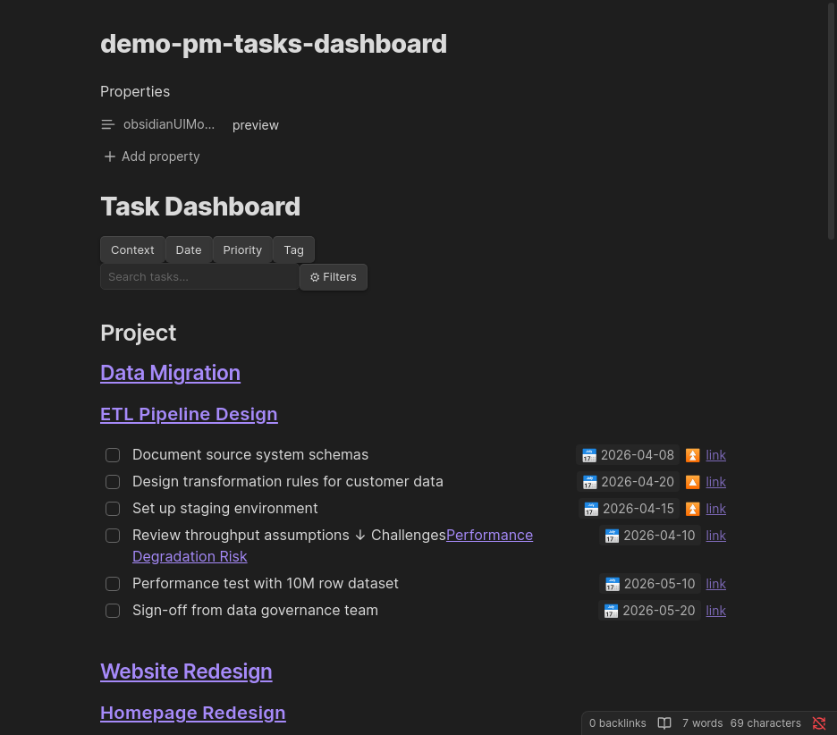
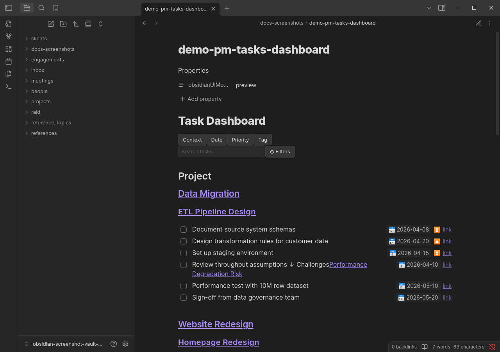
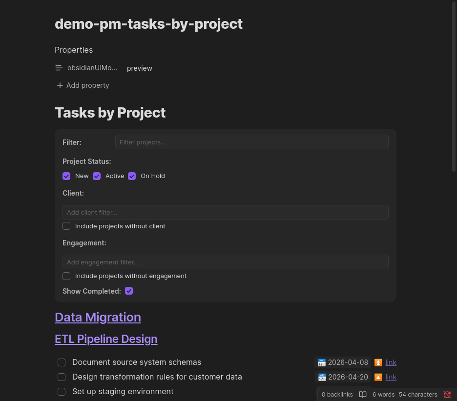

# pm-tasks

Renders a filterable, sortable task dashboard. Use it in dashboard mode for a vault-wide view of all tasks, or in by-project mode to browse tasks grouped by project.



---

## Configuration

````markdown
```pm-tasks
mode: dashboard | by-project

# Optional — override initial state:
viewMode: context | date | priority | tag
sortBy:
  - field: dueDate          # dueDate | priority | alphabetical | context | createdDate
    direction: asc          # asc | desc
showCompleted: false
dueDateFilter:
  selectedPresets: [Today]  # Today | Tomorrow | This Week | Next Week | Overdue | No Date
  rangeFrom: "2026-04-01"   # ISO date — custom range; clears presets
  rangeTo: "2026-04-30"
tagFilter: [tag1, tag2]
includeUntagged: false
```
````

| Parameter | Required | Default | Description |
|-----------|----------|---------|-------------|
| `mode` | Yes | — | `dashboard` for all-vault view; `by-project` for project-grouped view |
| `viewMode` | No | Setting default | Initial grouping mode (dashboard mode only) |
| `sortBy` | No | No sort | Array of up to 3 sort keys with direction |
| `showCompleted` | No | Setting default | Include completed tasks on first load |
| `dueDateFilter.selectedPresets` | No | None | One or more preset due date filters pre-selected on load |
| `dueDateFilter.rangeFrom` / `rangeTo` | No | None | Custom date range filter pre-selected on load |
| `tagFilter` | No | None | Tags pre-selected in the tag filter on load |
| `includeUntagged` | No | false | Whether to include untagged tasks when a tag filter is active |

---

## Dashboard Mode

All vault tasks are shown (the `utility/` folder is excluded). A toolbar appears at the top of the block.

### Toolbar

- **View mode tabs** — switch grouping between Context, Due Date, Priority, and Tag
- **Search input** — live text filter on task content
- **⚙ Filters button** — opens/closes the filter drawer; shows a count badge when filters are active
- **✕ Clear All Filters** — appears when any filter is active; resets all filters at once

### Active filter chips

When filters are active, a strip of removable chips appears below the toolbar. Click `×` on any chip to remove that individual filter.

### Filter drawer



The filter drawer contains:

| Section | Options |
|---------|---------|
| **Sort Order** | Up to 3 sort keys; fields: Due Date, Priority, Alphabetical, Context, Created Date; per-key direction (↑/↓); drag to reorder |
| **Completed Tasks** | Toggle to show/hide completed tasks |
| **Due Date** | Preset pills: Today, Tomorrow, This Week, Next Week, Overdue, No Date (multiple can be active, OR logic); or a custom From / To date range |
| **Priority** | Urgent, High, Medium, Low |
| **Context Type** | Project, Meeting, Recurring Meeting, Inbox, Daily Notes, Person, Other |
| **Client / Engagement** | Type-ahead chip selects; "Include unassigned" toggle |
| **Context-specific** (Context view only) | Project Status, Inbox Status, Meeting Date |
| **Tags** | Type-ahead chip select; "Include untagged" toggle |

### View modes

**Context view** groups tasks hierarchically:

- **Project tasks**: Parent Project → Project Note → Tasks. Tasks from project notes are nested under their parent project.
- **Recurring meeting tasks**: Parent Recurring Meeting → Event file → Tasks.
- **All other contexts**: File → Tasks.

**Due Date view** groups tasks by their due date (overdue, today, this week, future, no date).

**Priority view** groups tasks by priority: Urgent → High → Medium → Low → No Priority.

**Tag view** groups tasks by their tags. Tasks with multiple tags appear under each tag.

### Task checkboxes

Click any task checkbox to toggle it complete or incomplete. Completing a task adds a `✅ YYYY-MM-DD` completion date to the task line in the source file. Unchecking a completed task removes the completion date.

---

## By-Project Mode



Groups tasks by project. Only projects whose status matches the selected status filters are shown (defaults: New, Active, On Hold — Complete projects are hidden).

Filters available: status checkboxes, project name text filter, show completed toggle.

---

## Filter State Persistence

Filter state (view mode, active filters, sort order) is persisted to the note's frontmatter under the `pm-tasks-filters` key. The state is restored automatically when you re-open the note. Defaults set in the code block YAML apply only when no saved state exists for the note.
